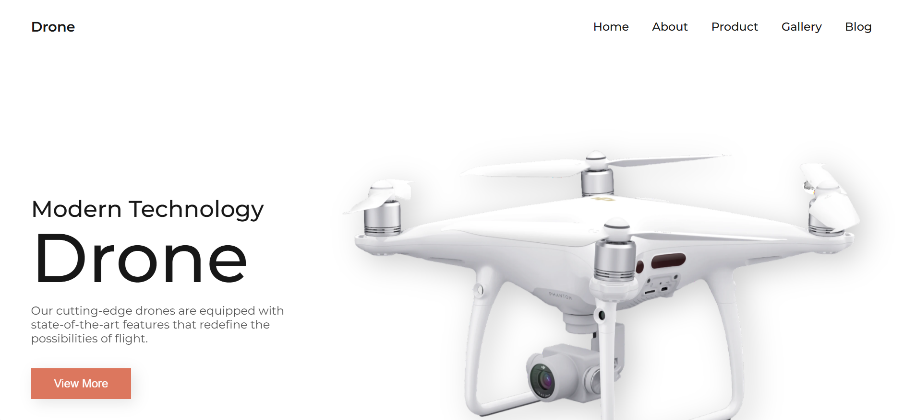

# 🚁 Drones Website



A modern and stylish **drone landing page** showcasing innovative drone technology, product categories, blogs, and a subscription section.  
Built with **HTML**, **CSS**, and **JavaScript**, this project highlights the power of clean design, animations, and interactivity.

---

## 🚀 Features

- 🛰️ **Modern Landing Page** — eye-catching layout for drone brands or tech companies.  
- 📱 **Fully Responsive Design** — adapts to all screen sizes.  
- 💫 **Smooth Animations** — powered by ScrollReveal.  
- 📸 **Gallery Section** — interactive cards with hover effects.  
- 🛒 **Product Highlights** — categorized products with images and descriptions.  
- 📰 **Blog Section** — displays latest articles and news updates.  
- 📧 **Newsletter Subscription** — allows users to subscribe for updates.  
- 🔗 **Footer with Quick Links** — includes company info and social media icons.

---

## 🧠 Demo

👉 **Live Demo:** [Click Here](#) 

---

## 🛠️ Tech Stack

- **HTML5** — structure  
- **CSS3** — layout and responsiveness  
- **JavaScript (ES6)** — interactivity  
- **Remix Icon** — for icons  
- **ScrollReveal.js** — for smooth animations  

---

## ⚙️ How to Use

1. **Clone this repository**
   ```bash
   git clone https://github.com/fsafiya187/Drones-Website.git

2.Navigate to the folder

cd Drones-Website


3.Run the project
Open index.html directly in your browser.

---

📚 Learning Highlights

Building a responsive drone landing page using pure HTML, CSS, and JS.

Using ScrollReveal to add smooth scroll-based animations.

Creating reusable sections like products, gallery, and articles.

Styling a modern navigation bar and footer layout.

---

🧾 License

This project is open-source and available under the MIT License

---

💬 Author

Safiya Fathima

🌐 http://github.com/fsafiya187

